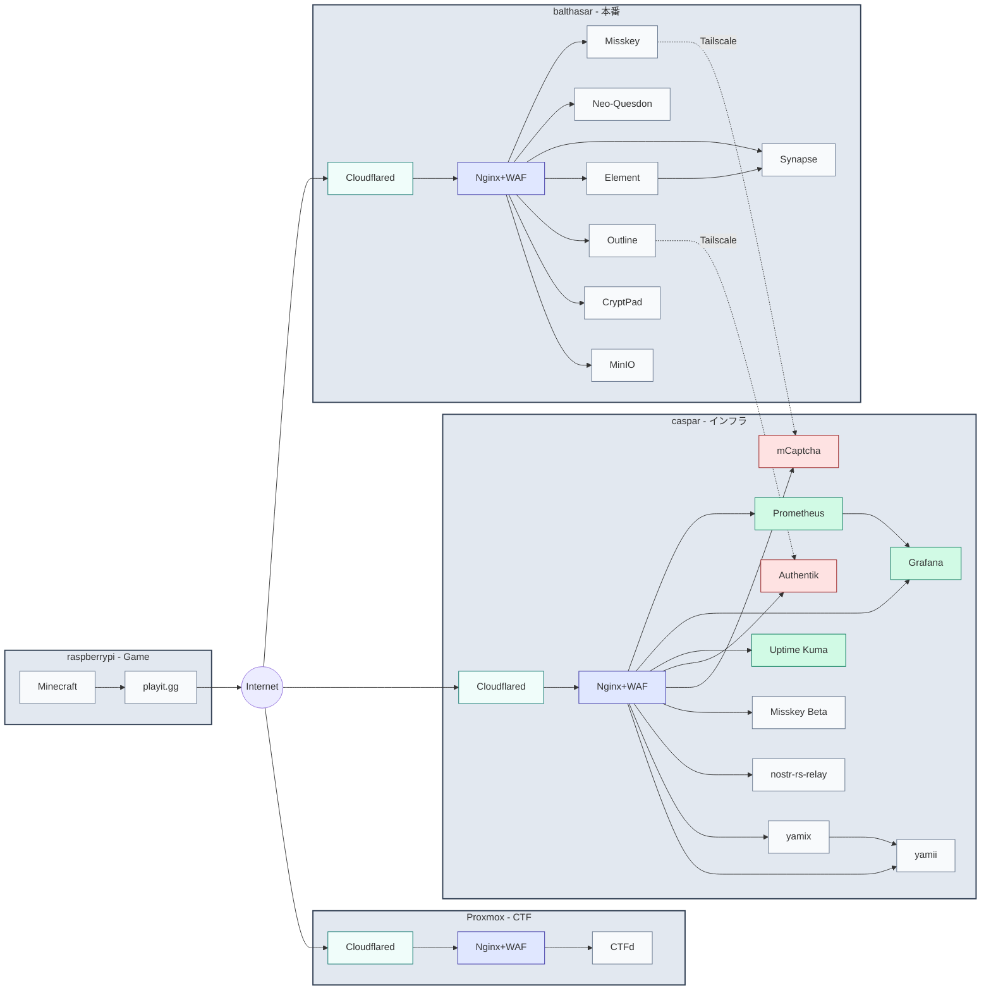
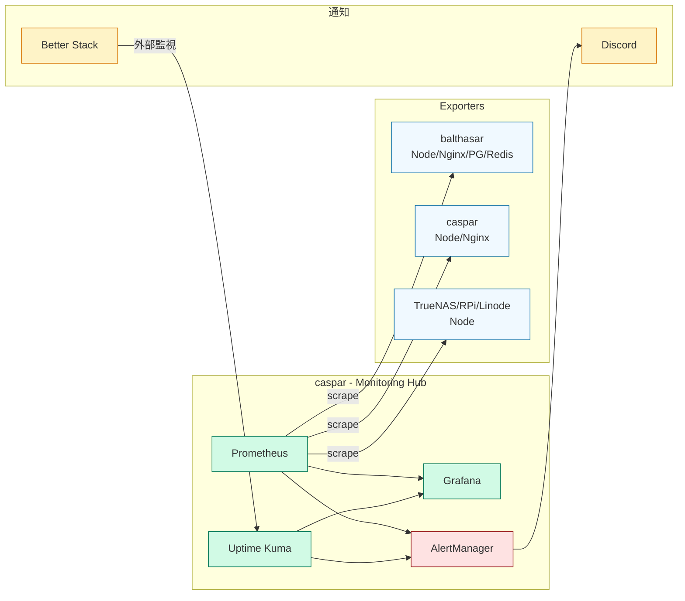
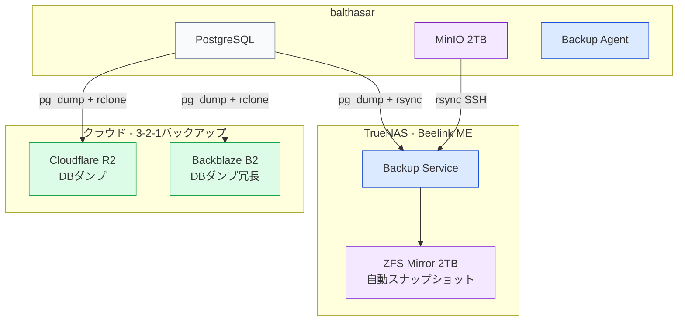
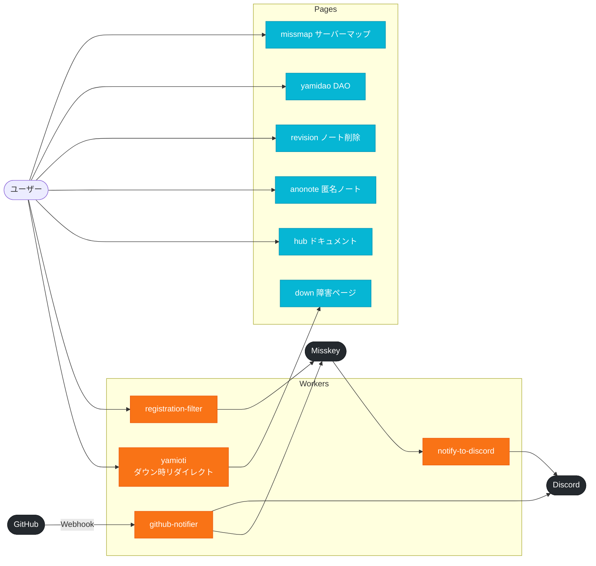
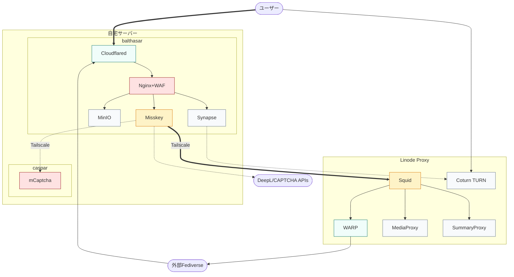

# yamisskey-host

## Service Architecture & Deployment Overview

```mermaid
graph LR
    classDef server fill:#e2e8f0,stroke:#334155,stroke-width:2px
    classDef cf fill:#f0fdfa,stroke:#0f766e
    classDef proxy fill:#e0e7ff,stroke:#3730a3
    classDef sec fill:#fee2e2,stroke:#991b1b
    classDef mon fill:#d1fae5,stroke:#047857
    classDef svc fill:#f8fafc,stroke:#64748b

    internet((Internet))

    subgraph balthasar[balthasar - 本番]
        direction TB
        cf_b[Cloudflared]:::cf --> nginx_b[Nginx+WAF]:::proxy

        nginx_b --> misskey[Misskey]:::svc
        nginx_b --> neoquesdon[Neo-Quesdon]:::svc
        nginx_b --> synapse[Synapse]:::svc
        nginx_b --> element[Element]:::svc
        nginx_b --> outline[Outline]:::svc
        nginx_b --> cryptpad[CryptPad]:::svc
        nginx_b --> minio[MinIO]:::svc
    end

    subgraph caspar[caspar - インフラ]
        direction TB
        cf_c[Cloudflared]:::cf --> nginx_c[Nginx+WAF]:::proxy

        nginx_c --> prometheus[Prometheus]:::mon
        nginx_c --> grafana[Grafana]:::mon
        nginx_c --> uptime[Uptime Kuma]:::mon
        nginx_c --> authentik[Authentik]:::sec
        nginx_c --> mcaptcha[mCaptcha]:::sec
        nginx_c --> misskey_beta[Misskey Beta]:::svc
        nginx_c --> nostr[nostr-rs-relay]:::svc
        nginx_c --> yamix[yamix]:::svc
        nginx_c --> yamii[yamii]:::svc
        yamix --> yamii
    end

    subgraph rpi[raspberrypi - Game]
        minecraft[Minecraft]:::svc --> playig[playit.gg]:::svc
    end

    subgraph proxmox[Proxmox - CTF]
        direction TB
        cf_p[Cloudflared]:::cf --> nginx_p[Nginx+WAF]:::proxy
        nginx_p --> ctfd[CTFd]:::svc
    end

    internet --> cf_b & cf_c & cf_p
    playig --> internet

    misskey -.->|Tailscale| mcaptcha
    outline -.->|Tailscale| authentik
    element --> synapse
    prometheus --> grafana

    class balthasar,caspar,rpi,proxmox server
```
## Monitoring & Alert System

```mermaid
graph LR
    classDef mon fill:#d1fae5,stroke:#047857
    classDef alert fill:#fee2e2,stroke:#991b1b
    classDef exp fill:#f0f9ff,stroke:#0369a1
    classDef ext fill:#fef3c7,stroke:#d97706

    subgraph hub[caspar - Monitoring Hub]
        prometheus[Prometheus]:::mon
        uptime[Uptime Kuma]:::mon
        grafana[Grafana]:::mon
        alertmgr[AlertManager]:::alert
    end

    subgraph exporters[Exporters]
        exp_b[balthasar<br/>Node/Nginx/PG/Redis]:::exp
        exp_c[caspar<br/>Node/Nginx]:::exp
        exp_other[TrueNAS/RPi/Linode<br/>Node]:::exp
    end

    subgraph notify[通知]
        discord[Discord]:::ext
        betterstack[Better Stack]:::ext
    end

    prometheus -->|scrape| exp_b & exp_c & exp_other
    prometheus & uptime --> grafana
    prometheus & uptime --> alertmgr --> discord
    betterstack -->|外部監視| uptime
```

## Storage & Backup Strategy

```mermaid
graph TB
    classDef cloud fill:#dcfce7,stroke:#16a34a
    classDef storage fill:#f3e8ff,stroke:#7e22ce
    classDef backup fill:#dbeafe,stroke:#1d4ed8
    classDef svc fill:#f8fafc,stroke:#64748b

    subgraph cloud_backup[クラウド - 3-2-1バックアップ]
        r2[Cloudflare R2<br/>DBダンプ]:::cloud
        b2[Backblaze B2<br/>DBダンプ冗長]:::cloud
    end

    subgraph balthasar[balthasar]
        db[PostgreSQL]:::svc
        minio[MinIO 2TB]:::storage
        agent[Backup Agent]:::backup
    end

    subgraph truenas[TrueNAS - Beelink ME]
        zfs[ZFS Mirror 2TB<br/>自動スナップショット]:::storage
        backup_svc[Backup Service]:::backup
    end

    db -->|pg_dump + rclone| r2 & b2
    db -->|pg_dump + rsync| backup_svc
    minio -->|rsync SSH| backup_svc
    backup_svc --> zfs
```

## Cloudflare Workers & Pages

```mermaid
graph LR
    classDef workers fill:#f97316,stroke:#ea580c,color:#fff
    classDef pages fill:#06b6d4,stroke:#0891b2,color:#fff
    classDef ext fill:#24292e,stroke:#1b1f23,color:#fff

    github([GitHub]):::ext
    misskey([Misskey]):::ext
    discord([Discord]):::ext
    users([ユーザー])

    subgraph workers[Workers]
        notifier[github-notifier]:::workers
        yamioti[yamioti<br/>ダウン時リダイレクト]:::workers
        signup[registration-filter]:::workers
        discord_notify[notify-to-discord]:::workers
    end

    subgraph pages[Pages]
        hub[hub ドキュメント]:::pages
        down[down 障害ページ]:::pages
        anonote[anonote 匿名ノート]:::pages
        revision[revision ノート削除]:::pages
        yamidao[yamidao DAO]:::pages
        missmap[missmap サーバーマップ]:::pages
    end

    github -->|Webhook| notifier --> misskey & discord
    misskey --> discord_notify --> discord
    users --> yamioti --> down
    users --> signup --> misskey
    users --> hub & anonote & revision & yamidao & missmap
```

## Network Traffic Flow

```mermaid
graph TB
    classDef cf fill:#f0fdfa,stroke:#0f766e
    classDef ts fill:#fef3c7,stroke:#d97706
    classDef sec fill:#fee2e2,stroke:#991b1b
    classDef svc fill:#f8fafc,stroke:#64748b

    users([ユーザー])
    federation([外部Fediverse])
    bypass([DeepL/CAPTCHA APIs])

    subgraph linode[Linode Proxy]
        squid[Squid]:::ts
        warp[WARP]:::cf
        mediaproxy[MediaProxy]:::svc
        summaryproxy[SummaryProxy]:::svc
        coturn[Coturn TURN]:::svc
    end

    subgraph home[自宅サーバー]
        subgraph balthasar[balthasar]
            cf_b[Cloudflared]:::cf
            nginx[Nginx+WAF]:::sec
            misskey[Misskey]:::ts
            minio[MinIO]:::svc
            synapse[Synapse]:::svc
        end

        subgraph caspar[caspar]
            mcaptcha[mCaptcha]:::sec
        end
    end

    %% ユーザーアクセス
    users ==> cf_b --> nginx --> misskey & minio & synapse
    federation --> cf_b

    %% 外部通信（Squid経由）
    misskey ==>|Tailscale| squid --> warp --> federation
    squid --> mediaproxy & summaryproxy

    %% 認証・VoIP
    misskey -.->|Tailscale| mcaptcha
    synapse -.-> coturn
    users --> coturn

    %% バイパス
    misskey -.-> bypass
```
