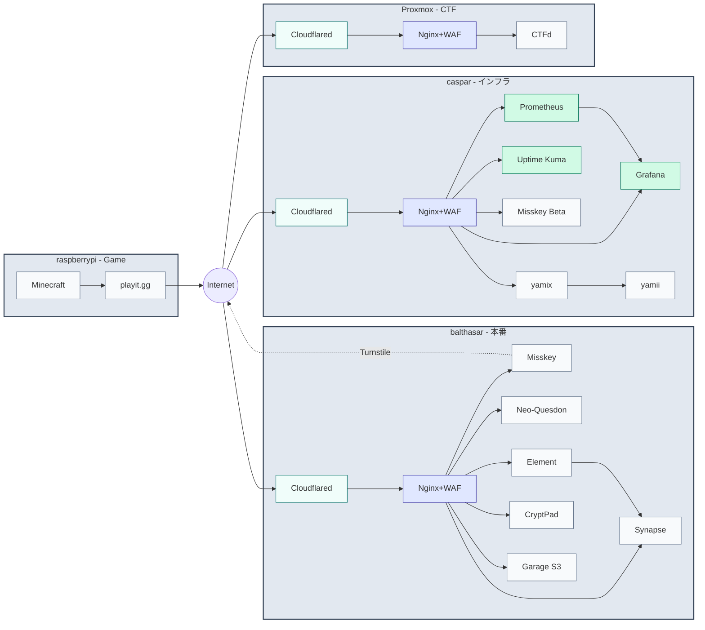
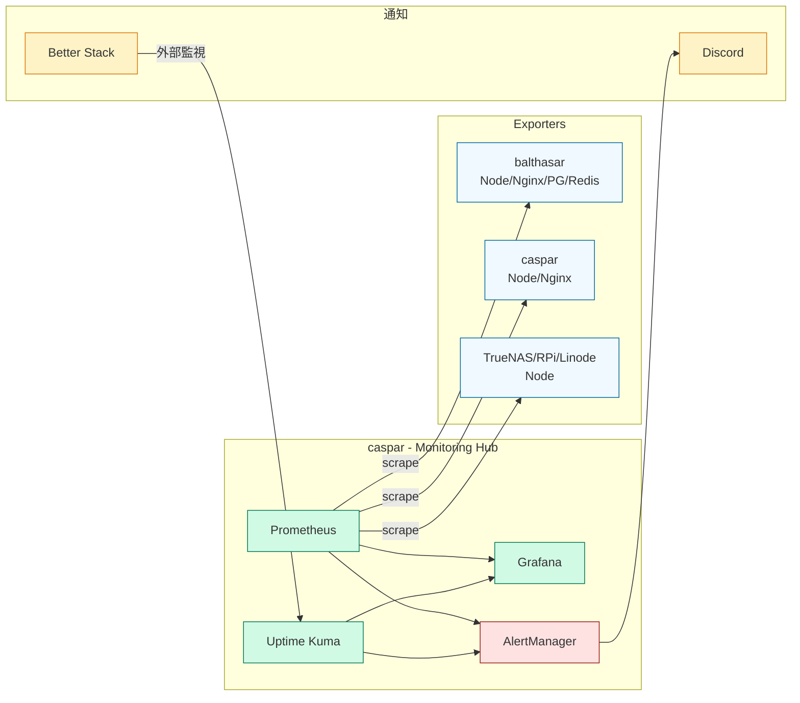
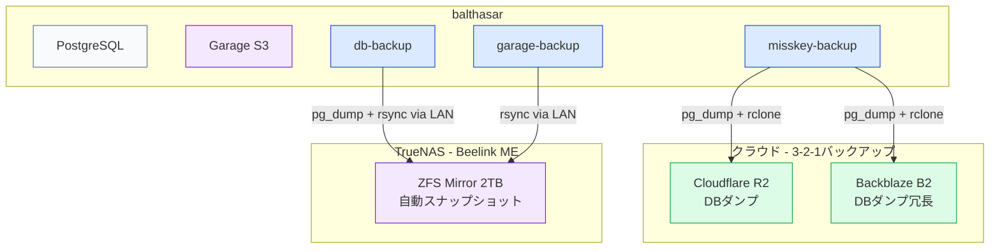
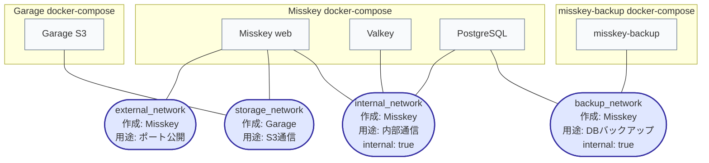
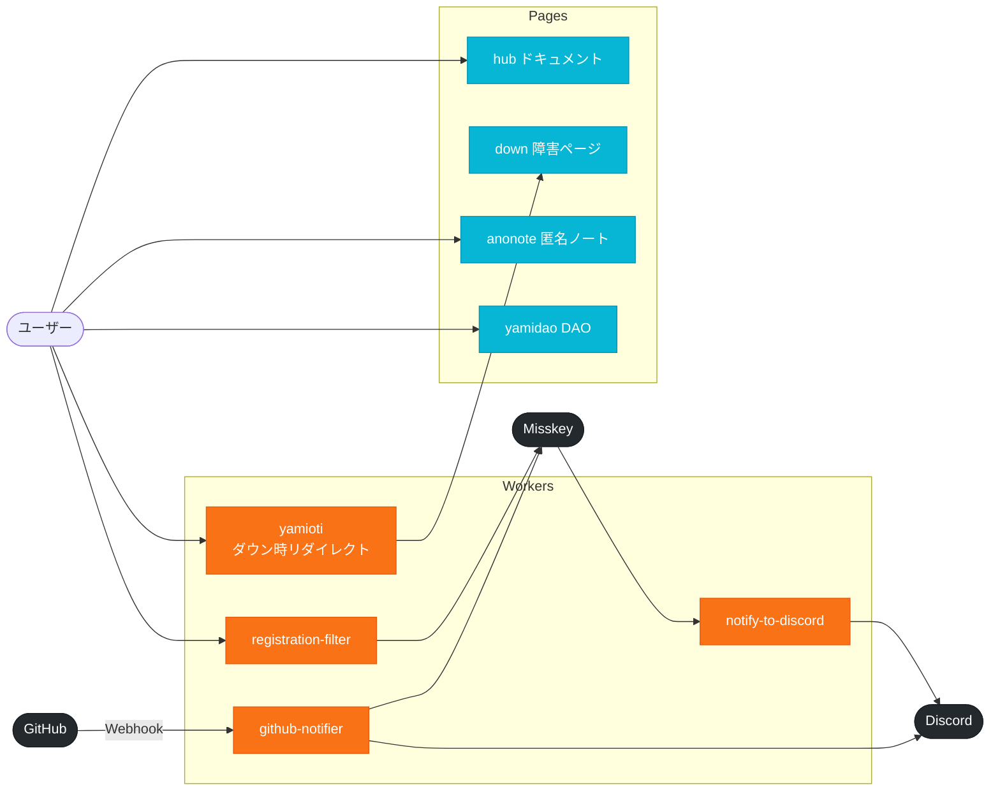
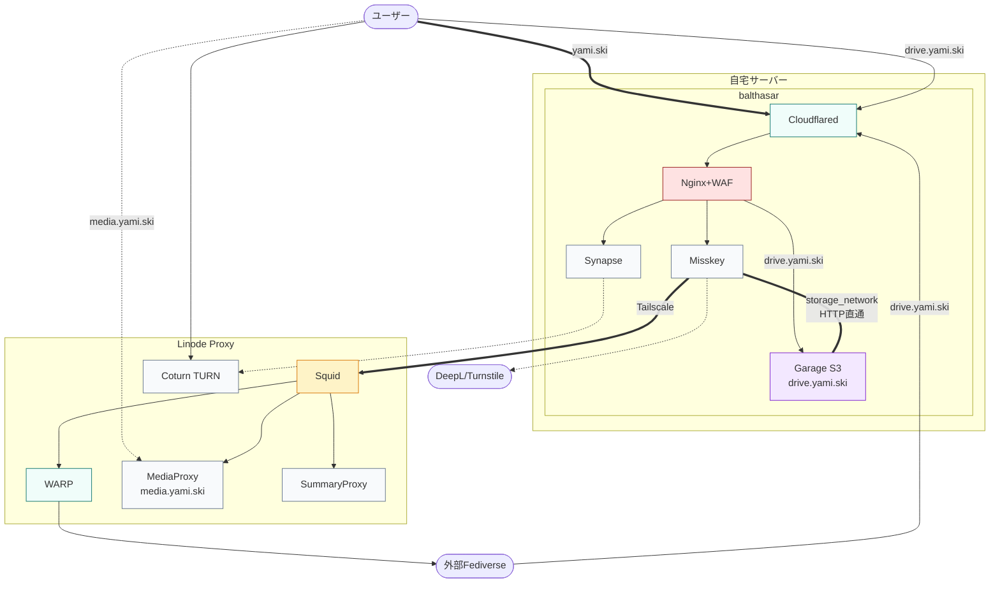

# yamisskey-host

## Service Architecture & Deployment Overview

```mermaid
graph LR
    classDef server fill:#e2e8f0,stroke:#334155,stroke-width:2px
    classDef cf fill:#f0fdfa,stroke:#0f766e
    classDef proxy fill:#e0e7ff,stroke:#3730a3
    classDef sec fill:#fee2e2,stroke:#991b1b
    classDef mon fill:#d1fae5,stroke:#047857
    classDef svc fill:#f8fafc,stroke:#64748b

    internet((Internet))

    subgraph balthasar[balthasar - 本番]
        direction TB
        cf_b[Cloudflared]:::cf --> nginx_b[Nginx+WAF]:::proxy

        nginx_b --> misskey[Misskey]:::svc
        nginx_b --> neoquesdon[Neo-Quesdon]:::svc
        nginx_b --> synapse[Synapse]:::svc
        nginx_b --> element[Element]:::svc
        nginx_b --> cryptpad[CryptPad]:::svc
        nginx_b --> garage[Garage S3]:::svc
    end

    subgraph caspar[caspar - インフラ]
        direction TB
        cf_c[Cloudflared]:::cf --> nginx_c[Nginx+WAF]:::proxy

        nginx_c --> prometheus[Prometheus]:::mon
        nginx_c --> grafana[Grafana]:::mon
        nginx_c --> uptime[Uptime Kuma]:::mon
        nginx_c --> misskey_beta[Misskey Beta]:::svc
        nginx_c --> yamix[yamix]:::svc
        yamix --> yamii[yamii]:::svc
    end

    subgraph rpi[raspberrypi - Game]
        minecraft[Minecraft]:::svc --> playig[playit.gg]:::svc
    end

    subgraph proxmox[Proxmox - CTF]
        direction TB
        cf_p[Cloudflared]:::cf --> nginx_p[Nginx+WAF]:::proxy
        nginx_p --> ctfd[CTFd]:::svc
    end

    internet --> cf_b & cf_c & cf_p
    playig --> internet

    misskey -.->|Turnstile| internet
    element --> synapse
    prometheus --> grafana

    class balthasar,caspar,rpi,proxmox server
```
## Monitoring & Alert System

```mermaid
graph LR
    classDef mon fill:#d1fae5,stroke:#047857
    classDef alert fill:#fee2e2,stroke:#991b1b
    classDef exp fill:#f0f9ff,stroke:#0369a1
    classDef ext fill:#fef3c7,stroke:#d97706

    subgraph hub[caspar - Monitoring Hub]
        prometheus[Prometheus]:::mon
        uptime[Uptime Kuma]:::mon
        grafana[Grafana]:::mon
        alertmgr[AlertManager]:::alert
    end

    subgraph exporters[Exporters]
        exp_b[balthasar<br/>Node/Nginx/PG/Redis]:::exp
        exp_c[caspar<br/>Node/Nginx]:::exp
        exp_other[TrueNAS/RPi/Linode<br/>Node]:::exp
    end

    subgraph notify[通知]
        discord[Discord]:::ext
        betterstack[Better Stack]:::ext
    end

    prometheus -->|scrape| exp_b & exp_c & exp_other
    prometheus & uptime --> grafana
    prometheus & uptime --> alertmgr --> discord
    betterstack -->|外部監視| uptime
```

## Storage & Backup Strategy

```mermaid
graph TB
    classDef cloud fill:#dcfce7,stroke:#16a34a
    classDef storage fill:#f3e8ff,stroke:#7e22ce
    classDef backup fill:#dbeafe,stroke:#1d4ed8
    classDef svc fill:#f8fafc,stroke:#64748b

    subgraph cloud_backup[クラウド - 3-2-1バックアップ]
        r2[Cloudflare R2<br/>DBダンプ]:::cloud
        b2[Backblaze B2<br/>DBダンプ冗長]:::cloud
    end

    subgraph balthasar[balthasar]
        db[PostgreSQL]:::svc
        garage[Garage S3]:::storage
        misskey_backup[misskey-backup]:::backup
        db_backup[db-backup]:::backup
        garage_backup[garage-backup]:::backup
    end

    subgraph truenas[TrueNAS - Beelink ME]
        zfs[ZFS Mirror 2TB<br/>自動スナップショット]:::storage
    end

    misskey_backup -->|pg_dump + rclone| r2 & b2
    db_backup -->|pg_dump + rsync via LAN| zfs
    garage_backup -->|rsync via LAN| zfs
```

## Docker Network Architecture (balthasar)

各サービスが自分の責務でネットワークを作成し、他サービスは `external: true` で参照する設計。

```mermaid
graph TB
    classDef net fill:#e0e7ff,stroke:#3730a3,stroke-width:2px
    classDef svc fill:#f8fafc,stroke:#64748b
    classDef creator fill:#d1fae5,stroke:#047857

    subgraph misskey_compose[Misskey docker-compose]
        web[Misskey web]:::svc
        redis[Valkey]:::svc
        db[PostgreSQL]:::svc
    end

    subgraph garage_compose[Garage docker-compose]
        garage[Garage S3]:::svc
    end

    subgraph backup_compose[misskey-backup docker-compose]
        backup[misskey-backup]:::svc
    end

    external_network([external_network<br/>作成: Misskey<br/>用途: ポート公開]):::net
    storage_network([storage_network<br/>作成: Garage<br/>用途: S3通信]):::net
    internal_network([internal_network<br/>作成: Misskey<br/>用途: 内部通信<br/>internal: true]):::net
    backup_network([backup_network<br/>作成: Misskey<br/>用途: DBバックアップ<br/>internal: true]):::net

    web --- external_network
    web --- storage_network
    web --- internal_network
    redis --- internal_network
    db --- internal_network
    db --- backup_network
    garage --- storage_network
    backup --- backup_network
```

| ネットワーク | 作成者 | 参照者 | internal | 用途 |
|--|--|--|--|--|
| `external_network` | Misskey | - | false | webのポート公開（nginx連携） |
| `storage_network` | Garage | Misskey | false | Misskey↔Garage S3 HTTP通信 |
| `internal_network` | Misskey | - | true | web↔db↔redis 内部通信 |
| `backup_network` | Misskey | misskey-backup | true | db↔misskey-backup DB接続 |

## Cloudflare Workers & Pages

```mermaid
graph LR
    classDef workers fill:#f97316,stroke:#ea580c,color:#fff
    classDef pages fill:#06b6d4,stroke:#0891b2,color:#fff
    classDef ext fill:#24292e,stroke:#1b1f23,color:#fff

    github([GitHub]):::ext
    misskey([Misskey]):::ext
    discord([Discord]):::ext
    users([ユーザー])

    subgraph workers[Workers]
        notifier[github-notifier]:::workers
        yamioti[yamioti<br/>ダウン時リダイレクト]:::workers
        signup[registration-filter]:::workers
        discord_notify[notify-to-discord]:::workers
    end

    subgraph pages[Pages]
        hub[hub ドキュメント]:::pages
        down[down 障害ページ]:::pages
        anonote[anonote 匿名ノート]:::pages
        yamidao[yamidao DAO]:::pages
    end

    github -->|Webhook| notifier --> misskey & discord
    misskey --> discord_notify --> discord
    users --> yamioti --> down
    users --> signup --> misskey
    users --> hub & anonote & yamidao
```

## Network Traffic Flow

```mermaid
graph TB
    classDef cf fill:#f0fdfa,stroke:#0f766e
    classDef ts fill:#fef3c7,stroke:#d97706
    classDef sec fill:#fee2e2,stroke:#991b1b
    classDef svc fill:#f8fafc,stroke:#64748b
    classDef storage fill:#f3e8ff,stroke:#7e22ce

    users([ユーザー])
    federation([外部Fediverse])
    bypass([DeepL/Turnstile])

    subgraph linode[Linode Proxy]
        squid[Squid]:::ts
        warp[WARP]:::cf
        mediaproxy[MediaProxy<br/>media.yami.ski]:::svc
        summaryproxy[SummaryProxy]:::svc
        coturn[Coturn TURN]:::svc
    end

    subgraph home[自宅サーバー]
        subgraph balthasar[balthasar]
            cf_b[Cloudflared]:::cf
            nginx[Nginx+WAF]:::sec
            misskey[Misskey]:::svc
            garage[Garage S3<br/>drive.yami.ski]:::storage
            synapse[Synapse]:::svc
        end
    end

    %% ユーザーアクセス (yami.ski)
    users ==>|yami.ski| cf_b --> nginx --> misskey & synapse

    %% 画像表示 (drive.yami.ski) - ユーザー/連合がブラウザで画像取得
    users -->|drive.yami.ski| cf_b
    federation -->|drive.yami.ski| cf_b
    nginx -->|drive.yami.ski| garage

    %% 画像アップロード - Docker内部HTTP (storage_network)
    misskey ===|storage_network<br/>HTTP直通| garage

    %% リモート画像プロキシ (media.yami.ski)
    users -.->|media.yami.ski| mediaproxy

    %% 連合通信（Squid経由）
    misskey ==>|Tailscale| squid --> warp --> federation
    squid --> mediaproxy & summaryproxy

    %% VoIP
    synapse -.-> coturn
    users --> coturn

    %% バイパス
    misskey -.-> bypass
```
