# yamihost

## Service Architecture & Deployment Overview

```mermaid
graph TB
    %% Style definitions
    classDef homeServer fill:#e2e8f0,stroke:#334155,stroke-width:2px
    classDef service fill:#f8fafc,stroke:#64748b,stroke-width:1px
    classDef rpi fill:#fde68a,stroke:#d97706,stroke-width:2px
    classDef proxy fill:#e0e7ff,stroke:#3730a3,stroke-width:2px
    classDef cloudflare fill:#f0fdfa,stroke:#0f766e,stroke-width:1.5px
    classDef security fill:#fee2e2,stroke:#991b1b,stroke-width:1px
    classDef storage fill:#dcfce7,stroke:#16a34a,stroke-width:2px
    classDef local fill:#86efac,stroke:#16a34a,stroke-width:3px
    classDef activitypubStyle fill:#f3e8ff,stroke:#7c3aed,stroke-width:2px
    classDef nostrStyle fill:#fed7aa,stroke:#ea580c,stroke-width:2px
    classDef matrixStyle fill:#dbeafe,stroke:#1d4ed8,stroke-width:2px
    classDef appsStyle fill:#fef3c7,stroke:#ca8a04,stroke-width:2px
    classDef monitoring fill:#d1fae5,stroke:#047857,stroke-width:2px
    classDef iac fill:#f0f9ff,stroke:#0369a1,stroke-width:2px
    classDef rtcStyle fill:#fce7f3,stroke:#db2777,stroke-width:2px
    
    %% Main Infrastructure
    subgraph main_servers[Main Servers]
        direction LR
        
        subgraph balthasar[balthasar - 本番環境<br/>ユーザー向けサービス専用]
            direction TB
            cloudflared_b[Cloudflared]:::cloudflare
            nginx_b[Nginx + ModSecurity<br/>Reverse Proxy]:::proxy
            
            subgraph activitypub[ActivityPub]
                yui[Misskey Bot]:::service
                yamisskey[Misskey]:::service
                neoquesdon[Neo-Quesdon]:::service
            end
            
            subgraph matrix[Matrix]
                synapse[Synapse]:::service
                element[Element]:::service
            end
            
            subgraph rtc[Real-Time Communication]
                jitsi_meet[Jitsi Meet<br/>Web UI]:::service
                jicofo[Jicofo<br/>Conference Focus]:::service
                jvb[Jitsi Videobridge<br/>Media Server]:::service
                prosody[Prosody<br/>XMPP Server]:::service
            end
            
            subgraph apps[Apps]
                outline[Outline]:::service
                cryptpad[CryptPad]:::service
                minio[MinIO]:::storage
            end
        end
        
        subgraph caspar[caspar - インフラ・監視・セキュリティ基盤]
            direction TB
            cloudflared_c[Cloudflared]:::cloudflare
            nginx_c[Nginx + ModSecurity<br/>Reverse Proxy]:::proxy
            
            subgraph monitoring_services[監視・IaC]
                prometheus[Prometheus]:::monitoring
                grafana[Grafana]:::monitoring
                uptime[Uptime Kuma]:::monitoring
                alertmgr[AlertManager]:::monitoring
                terraform[Terraform]:::iac
                ansible[Ansible]:::iac
            end
            
            subgraph auth_services[認証・セキュリティ]
                authentik[Authentik]:::security
                mcaptcha[mCaptcha]:::security
            end
            
            subgraph nostr[Nostr - 実験系]
                nostream[Nostream]:::service
                rabbit[Rabbit]:::service
            end
        end
        
        subgraph raspberrypi[raspberrypi - Minecraft専用<br/>NVMe SSD 2TB, 8GB RAM]
            direction TB
            playig[playit.gg]:::service
            
            subgraph games[Games]
                minecraft[Minecraft Java<br/>6GB RAM]:::service
            end
        end
        
        internet((Internet)):::cloudflare
    end
    
    %% Cloudflared to MinIO connections
    nginx_b --> minio

    %% Cross-server authentication connections (via Tailscale)
    outline -.->|Tailscale| authentik
    yamisskey -.->|Tailscale| mcaptcha
    
    %% Jitsi internal connections
    jitsi_meet --> prosody
    jicofo --> prosody
    jvb --> prosody
    
    %% Other core connections
    element --> synapse
    minecraft --> playig
    prometheus --> grafana
    
    %% Cloudflared to Nginx connections
    cloudflared_b --> nginx_b
    cloudflared_c --> nginx_c
    
    %% Nginx to services - balthasar
    nginx_b --> yamisskey
    nginx_b --> neoquesdon
    nginx_b --> element
    nginx_b --> synapse
    nginx_b --> outline
    nginx_b --> cryptpad
    nginx_b --> jitsi_meet
    
    %% Nginx to services - caspar
    nginx_c --> prometheus
    nginx_c --> grafana
    nginx_c --> uptime
    nginx_c --> authentik
    nginx_c --> mcaptcha
    nginx_c --> nostream
    nginx_c --> rabbit
    
    %% External connections
    playig --> internet
    cloudflared_b --> internet
    cloudflared_c --> internet
    
    %% Apply styles to subgraphs
    class balthasar,caspar homeServer
    class raspberrypi rpi
    class activitypub activitypubStyle
    class nostr nostrStyle
    class matrix matrixStyle
    class rtc rtcStyle
    class apps appsStyle
    class games service
    class auth_services security
    class monitoring_services monitoring
    class cloudflared_b,cloudflared_c cloudflare
    class nginx_b,nginx_c proxy
```

## Proxmox Virtualization Platform & Security Environment

```mermaid
graph TB
    %% Style definitions
    classDef homeServer fill:#e2e8f0,stroke:#334155,stroke-width:2px
    classDef service fill:#f8fafc,stroke:#64748b,stroke-width:1px
    classDef monitoring fill:#d1fae5,stroke:#047857,stroke-width:1px
    classDef security fill:#fee2e2,stroke:#991b1b,stroke-width:1px
    classDef storage fill:#f3e8ff,stroke:#7e22ce,stroke-width:1.5px
    classDef network fill:#fff3e0,stroke:#ef6c00,stroke-width:2px
    classDef ctf fill:#fef3c7,stroke:#d97706,stroke-width:2px
    
    %% Proxmox Host
    subgraph proxmox["GMKtec NucBox K10 - Proxmox VE<br/>Core i9-13900HK, 64GB DDR5, 1TB NVMe"]
       %% Storage Configuration
       subgraph storage["Storage Pools"]
           local["local<br/>ISO, Templates, Backups"]:::storage
           local_lvm["local-lvm<br/>VM Disks"]:::storage
       end
       
       %% Network Bridges
       subgraph networks["Virtual Networks"]
           vmbr0["vmbr0 - External<br/>WAN Interface"]:::network
           vmbr1["vmbr1 - Internal LAN<br/>10.0.0.0/24"]:::network
           vmbr2["vmbr2 - DMZ<br/>192.168.100.0/24"]:::network
           vmbr3["vmbr3 - Management<br/>172.16.0.0/24"]:::network
       end
       
       %% Virtual Machines
       subgraph vms["Virtual Machines"]
           subgraph pfsense_vm["pfSense VM - 4c/8GB/32GB"]
               pfsense["pfSense 2.7+"]:::security
               haproxy["HAProxy"]:::service
               openvpn["OpenVPN"]:::security
           end
           
           subgraph tpot_vm["T-Pot VM - 8c/24GB/200GB"]
               tpot["T-Pot 24.04+"]:::security
               cowrie["Cowrie SSH Honeypot"]:::security
               dionaea["Dionaea Multi-protocol"]:::security
               elasticpot["ElasticPot"]:::security
               kibana_tpot["Kibana Dashboard"]:::monitoring
           end
           
           subgraph malcolm_vm["Malcolm VM - 12c/32GB/500GB"]
               malcolm["Malcolm"]:::monitoring
               elasticsearch["Elasticsearch"]:::monitoring
               logstash["Logstash"]:::monitoring
               zeek["Zeek Network Analysis"]:::monitoring
               suricata_malcolm["Suricata IDS"]:::security
               kibana_malcolm["Kibana Analytics"]:::monitoring
           end
           
           subgraph ctf_vm["CTF VM - 4c/8GB/100GB"]
               ctfd["CTFd<br/>競技プラットフォーム"]:::ctf
               challenge_containers["Challenge Containers<br/>Docker隔離環境"]:::ctf
               ctf_web["CTF Web Challenges"]:::ctf
               ctf_pwn["Pwn/Reversing Challenges"]:::ctf
           end
       end
    end
    
    %% Network connections
    vmbr0 --> pfsense_vm
    vmbr2 --> tpot_vm
    vmbr2 --> malcolm_vm
    vmbr2 --> ctf_vm
    vmbr3 --> pfsense_vm
    
    %% Storage connections
    local_lvm --> pfsense_vm
    local_lvm --> tpot_vm
    local_lvm --> malcolm_vm
    local_lvm --> ctf_vm
    
    %% Service connections
    tpot --> kibana_tpot
    malcolm --> elasticsearch
    suricata_malcolm --> malcolm
    ctfd --> challenge_containers
    
    %% Apply styles
    class proxmox homeServer
    class pfsense_vm,tpot_vm,malcolm_vm,ctf_vm homeServer
```

## Infrastructure as Code & Automation Systems

```mermaid
graph TB
    %% Style definitions
    classDef iac fill:#f0f9ff,stroke:#0369a1,stroke-width:2px
    classDef automation fill:#cffafe,stroke:#06b6d4,stroke-width:2px
    classDef homeServer fill:#e2e8f0,stroke:#334155,stroke-width:2px
    classDef alert fill:#fef3c7,stroke:#d97706,stroke-width:2px

    %% Source Control
    subgraph source["ソースコード管理"]
        git["Git Repository<br/>Infrastructure as Code"]:::iac
        actions["GitHub Actions<br/>CI/CD Pipeline"]:::automation
    end

    %% Control Plane
    subgraph caspar["caspar - 制御ハブ"]
        terraform["Terraform<br/>インフラ定義・プロビジョニング"]:::iac
        ansible["Ansible<br/>設定管理・デプロイ"]:::automation
        cloud_init["Cloud-init<br/>VM初期化"]:::automation
    end

    %% Managed Infrastructure
    subgraph infra["管理対象インフラ"]
        subgraph proxmox_infra["Proxmox (Terraform管理)"]
            proxmox_vms["Virtual Machines<br/>• pfSense (4c/8GB/32GB)<br/>• T-Pot (8c/24GB/200GB)<br/>• Malcolm (12c/32GB/500GB)<br/>• CTF (4c/8GB/100GB)"]:::homeServer
            proxmox_storage["Storage: local-lvm"]:::homeServer
            proxmox_network["Networks: vmbr0-3"]:::homeServer
        end
        physical["物理サーバー (Ansible管理)<br/>• balthasar<br/>• caspar"]:::homeServer
        truenas["TrueNAS (Ansible管理)<br/>ストレージ・バックアップ"]:::homeServer
        linode["Linode (Ansible管理)<br/>• linode-proxy<br/>• Coturn"]:::homeServer
    end

    %% Notifications
    slack["Slack<br/>デプロイ通知"]:::alert
    discord["Discord<br/>変更通知"]:::alert

    %% Workflow
    git --> actions
    actions --> terraform
    actions --> ansible
    
    terraform -->|VM作成・更新<br/>ストレージ割り当て<br/>ネットワーク設定| proxmox_infra
    ansible -->|設定適用| physical
    ansible -->|設定適用| truenas
    ansible -->|設定適用| linode
    cloud_init -->|初期設定| proxmox_vms

    %% Notifications
    actions --> slack
    terraform --> discord
    ansible --> discord

    %% Apply styles
    class caspar homeServer
    class proxmox_infra homeServer
```

## Monitoring ＆ Alert System

```mermaid
graph TB
    %% Style definitions
    classDef monitoring fill:#d1fae5,stroke:#047857,stroke-width:2px
    classDef homeServer fill:#e2e8f0,stroke:#334155,stroke-width:2px
    classDef alert fill:#fef3c7,stroke:#d97706,stroke-width:2px
    classDef app fill:#fce7f3,stroke:#be185d,stroke-width:1.5px
    classDef security fill:#fee2e2,stroke:#991b1b,stroke-width:1px
    
    %% Monitoring Hub (caspar) - セルフホスト化
    subgraph caspar["🏛️ caspar - 監視・セキュリティハブ (セルフホスト)"]
        prometheus["Prometheus Server<br/>9090<br/>メトリクス収集・保存"]:::monitoring
        grafana["Grafana<br/>3000<br/>ダッシュボード"]:::monitoring
        uptime["Uptime Kuma<br/>3009<br/>死活監視"]:::monitoring
        alertmgr["AlertManager<br/>9093<br/>通知管理"]:::alert
        authentik_mon["Authentik<br/>認証基盤"]:::security
        mcaptcha_mon["mCaptcha<br/>CAPTCHA基盤"]:::security
    end
    
    %% All Monitored Systems (consolidated)
    subgraph systems["監視対象システム"]
        balthasar_node["balthasar<br/>Node/cAdvisor<br/>Misskey/Outline/MinIO/Jitsi"]:::homeServer
        joseph_node["joseph<br/>Node Exporter<br/>TrueNAS SCALE"]:::homeServer
        raspberry_node["raspberrypi<br/>Node Exporter<br/>Minecraft"]:::homeServer
        linode_node["linode_prox<br/>Media Proxy/Summaly/Coturn"]:::homeServer
        proxmox_node["Proxmox VMs<br/>pfSense/T-Pot/Malcolm/CTF"]:::homeServer
    end
    
    %% Application Notifications
    subgraph app_notify["アプリケーション通知"]
        misskey_webhook["Misskey<br/>Webhook"]:::app
        backup_notify["バックアップ<br/>結果通知"]:::app
        jitsi_webhook["Jitsi<br/>会議イベント"]:::app
    end
    
    %% External Notifications
    discord["Discord"]:::alert
    slack["Slack"]:::alert
    
    %% Monitoring Flow (Full Prometheus)
    systems --> prometheus
    prometheus --> grafana
    
    %% Alert Flow
    uptime --> alertmgr
    prometheus -->|アラートルール| alertmgr
    
    alertmgr --> discord
    alertmgr --> slack
    
    %% Direct App Notifications
    misskey_webhook --> discord
    backup_notify --> discord
    jitsi_webhook --> discord
    
    %% Apply styles
    class caspar monitoring
    class systems homeServer
```

## Storage & Backup Strategy

## Cloudflare Workers & Pages Services

```mermaid
graph TB
    %% Style definitions
    classDef workers fill:#f97316,stroke:#ea580c,stroke-width:2px,color:#ffffff
    classDef pages fill:#06b6d4,stroke:#0891b2,stroke-width:2px,color:#ffffff
    classDef github fill:#24292e,stroke:#1b1f23,stroke-width:2px,color:#ffffff
    classDef misskey fill:#86b300,stroke:#638600,stroke-width:2px,color:#ffffff
    classDef cloudflare fill:#f0fdfa,stroke:#0f766e,stroke-width:1.5px
    classDef user fill:#fef9c3,stroke:#ca8a04,stroke-width:1.5px

    %% External Services
    github_api([GitHub API<br/>Webhook/Events]):::github
    misskey_api([Misskey API<br/>yami.ski]):::misskey
    discord_api([Discord<br/>Webhook]):::github
    users([ユーザー]):::user

    subgraph cloudflare_edge["Cloudflare Edge Network"]
        direction TB

        subgraph workers_apps["Workers (サーバーレス関数)"]
            direction TB
            notifier["yamisskey-github-notifier-next<br/>GitHub開発状況 → Discord/Misskey通知"]:::workers
            yamioti["yamioti<br/>ダウン時リダイレクト"]:::workers
            signup_filter["misskey-registration-filter<br/>登録フィルター"]:::workers
            discord_notify["misskey-notify-to-discord<br/>管理者通知 → Discord転送"]:::workers
        end

        subgraph pages_apps["Pages (静的サイトホスティング)"]
            direction TB
            hub["yamisskey-hub-starlight<br/>ドキュメントサイト (Starlight)"]:::pages
            down["yamisskey-down<br/>メンテナンス・障害ページ"]:::pages
            anonote["yamisskey-anonote<br/>匿名ノートサービス"]:::pages
            revision["yamisskey-revision<br/>闇消し (ノート削除ツール)"]:::pages
            yamidao["yamidao<br/>DAO ガバナンスサイト"]:::pages
            missmap["missmap<br/>Misskeyサーバーマップ"]:::pages
        end
    end

    %% Connections - Workers
    github_api -->|"Webhook<br/>Push/PR/Issue Events"| notifier
    notifier -->|"開発状況通知"| misskey_api
    notifier -->|"開発状況通知"| discord_api

    misskey_api -->|"管理者通知"| discord_notify
    discord_notify -->|"通知転送"| discord_api

    users -->|"yami.ski<br/>アクセス"| yamioti
    yamioti -->|"ダウン時"| down
    yamioti -.->|"正常時"| misskey_api

    users -->|"新規登録<br/>リクエスト"| signup_filter
    signup_filter -->|"フィルタ済み<br/>リクエスト"| misskey_api

    %% Connections - Pages
    users -->|"ドキュメント<br/>閲覧"| hub
    users -->|"障害情報<br/>確認"| down
    users -->|"匿名ノート<br/>作成"| anonote
    users -->|"ノート<br/>削除"| revision
    users -->|"DAO参加"| yamidao
    users -->|"サーバーマップ<br/>閲覧"| missmap

    %% Apply styles
    class cloudflare_edge cloudflare
```

## Network Traffic Flow & Proxy Configuration

```mermaid
graph TB
classDef homeServer fill:#e2e8f0,stroke:#334155,stroke-width:2px
classDef service fill:#f8fafc,stroke:#64748b,stroke-width:1px
classDef security fill:#fee2e2,stroke:#991b1b,stroke-width:1px
classDef cloudflare fill:#f0fdfa,stroke:#0f766e,stroke-width:1.5px
classDef user fill:#fef9c3,stroke:#ca8a04,stroke-width:1.5px
classDef federation fill:#f3e8ff,stroke:#7c3aed,stroke-width:1.5px
classDef direct fill:#dcfce7,stroke:#16a34a,stroke-width:2px
classDef tailscale fill:#fef3c7,stroke:#d97706,stroke-width:2px
classDef storage fill:#f3e8ff,stroke:#7e22ce,stroke-width:1.5px
classDef rtc fill:#fce7f3,stroke:#db2777,stroke-width:2px

%% External actors
enduser([エンドユーザー<br/>Webブラウザ]):::user
external_servers([外部サーバー<br/>（他Misskey・画像・API等）]):::federation
bypass_services([DeepL API<br/>reCAPTCHA<br/>hCaptcha<br/>Cloudflare Challenges]):::direct

subgraph support[Support Infrastructure]
    direction TB
    
    subgraph linode[Linode Servers]
        direction TB
        subgraph proxy[linode-proxy]
            summaryproxy[Summary proxy<br/>独自IP]:::direct
            mediaproxy[Media proxy<br/>独自IP]:::direct
            squid[Squid プロキシ<br/>🔗 Tailscale ACL制限]:::tailscale
            warp[Cloudflare WARP<br/>drive.yami.ski除外]:::cloudflare
            cloudflared_p[Cloudflared]:::cloudflare
            coturn[Coturn<br/>TURN/STUN Server<br/>UDP 3478, 5349<br/>UDP 49152-65535]:::rtc
        end
    end
    
    subgraph homeservers[🏠 自宅サーバー群]
        direction TB
        subgraph balthasar_server[balthasar - 本番環境]
            nginx_misskey[Nginx + ModSecurity<br/>WAF・Reverse Proxy]:::security
            yamisskey[Misskey<br/>🔗 Tailscale接続]:::tailscale
            minio_local[MinIO<br/>オブジェクトストレージ]:::storage
            cloudflared_bc[Cloudflared]:::cloudflare
            jitsi_stack[Jitsi Meet Stack<br/>Meet/Jicofo/JVB/Prosody]:::rtc
        end
        
        subgraph caspar_server[caspar - インフラ基盤]
            nginx_caspar[Nginx + ModSecurity]:::security
            authentik_svc[Authentik<br/>認証基盤]:::security
            mcaptcha_svc[mCaptcha<br/>CAPTCHA基盤]:::security
            cloudflared_cs[Cloudflared]:::cloudflare
        end
    end
end

%% エンドユーザーのアクセス経路（太線）
enduser ==>|"①Web UI アクセス"| cloudflared_bc
cloudflared_bc ==> nginx_misskey
nginx_misskey ==> yamisskey
nginx_misskey ==> minio_local
nginx_misskey ==> jitsi_stack

%% 外部サーバーからの連合リクエスト（通常線）
external_servers -->|"②連合リクエスト"| cloudflared_bc

%% MisskeyからMinIOへのCloudflared経由接続
yamisskey ==>|"③Cloudflared経由"| cloudflared_bc
cloudflared_bc ==>|"MinIOアクセス"| nginx_misskey

%% Misskeyから認証基盤へのTailscale経由接続
yamisskey -.->|"🔗 Tailscale<br/>mCaptcha認証"| mcaptcha_svc

%% Jitsi WebRTC NAT越え（TURN経由）
jitsi_stack ==>|"⑦WebRTC メディア<br/>NAT越え"| coturn
enduser ==>|"⑧TURN/STUN<br/>UDP 3478, 5349"| coturn
coturn ==>|"メディアリレー<br/>UDP 49152-65535"| enduser

%% Misskeyサーバーからの全外部通信はSquid経由
yamisskey ==>|"④🔗 Tailscale経由<br/>全外部通信"| squid
squid --> warp

%% WARPからの分岐
warp -->|"外部サーバーへ"| external_servers
warp ==>|"SummaryProxy<br/>アクセス"| cloudflared_p
warp -->|"外部URL情報取得"| summaryproxy
cloudflared_p ==> mediaproxy
cloudflared_p -.-> summaryproxy
squid ==>|"MediaProxy<br/>アクセス"| cloudflared_p

%% MediaProxyからMisskeyへ画像処理結果を返却
mediaproxy ==>|"⑤画像取得/変換結果<br/>返却"| cloudflared_bc

%% SummaryProxyからの返却
summaryproxy -.->|"⑥URL情報取得結果<br/>返却"| cloudflared_bc

%% プロキシバイパス対象（特定APIサービス）
yamisskey -.->|"プロキシバイパス<br/>API直接アクセス"| bypass_services
bypass_services -.->|"API結果返却<br/>（翻訳・CAPTCHA等）"| yamisskey
```

## Jitsi Meet & Coturn Architecture

```mermaid
graph TB
    classDef user fill:#fef9c3,stroke:#ca8a04,stroke-width:1.5px
    classDef jitsi fill:#fce7f3,stroke:#db2777,stroke-width:2px
    classDef turn fill:#dbeafe,stroke:#2563eb,stroke-width:2px
    classDef cloudflare fill:#f0fdfa,stroke:#0f766e,stroke-width:1.5px
    classDef homeServer fill:#e2e8f0,stroke:#334155,stroke-width:2px
    classDef linode fill:#dcfce7,stroke:#16a34a,stroke-width:2px

    %% Users
    user_a([参加者 A<br/>NAT配下]):::user
    user_b([参加者 B<br/>NAT配下]):::user
    user_c([参加者 C<br/>グローバルIP]):::user

    subgraph internet["Internet"]
        stun_check{{"STUN<br/>接続性チェック"}}
    end

    subgraph linode_dc["Linode (グローバルIP)"]
        subgraph coturn_server["Coturn Server"]
            stun_svc["STUN Service<br/>UDP/TCP 3478<br/>NAT タイプ検出"]:::turn
            turn_svc["TURN Service<br/>UDP/TCP 5349 (TLS)<br/>メディアリレー"]:::turn
            media_ports["Media Relay Ports<br/>UDP 49152-65535<br/>実際の音声/映像転送"]:::turn
        end
    end

    subgraph balthasar["balthasar (自宅サーバー)"]
        cloudflared_j[Cloudflared]:::cloudflare
        nginx_j[Nginx Reverse Proxy<br/>HTTPS終端]:::homeServer
        
        subgraph jitsi_components["Jitsi Meet Stack"]
            jitsi_web["Jitsi Meet Web<br/>React SPA<br/>会議UI"]:::jitsi
            prosody_xmpp["Prosody XMPP<br/>シグナリング<br/>参加者管理"]:::jitsi
            jicofo_focus["Jicofo<br/>Conference Focus<br/>会議制御"]:::jitsi
            jvb_bridge["Jitsi Videobridge<br/>SFU (Selective Forwarding Unit)<br/>メディア配信"]:::jitsi
        end
    end

    %% Web UI Access (HTTPS via Cloudflare Tunnel)
    user_a -->|"①HTTPS<br/>会議参加"| cloudflared_j
    user_b -->|"①HTTPS<br/>会議参加"| cloudflared_j
    user_c -->|"①HTTPS<br/>会議参加"| cloudflared_j
    cloudflared_j --> nginx_j
    nginx_j --> jitsi_web

    %% Jitsi Internal Flow
    jitsi_web -->|"②WebSocket<br/>XMPP-over-BOSH"| prosody_xmpp
    prosody_xmpp --> jicofo_focus
    jicofo_focus --> jvb_bridge

    %% ICE Candidate Gathering
    user_a -.->|"③STUN Request<br/>自己IPアドレス取得"| stun_svc
    user_b -.->|"③STUN Request"| stun_svc
    stun_svc -.->|"Public IP返却"| user_a
    stun_svc -.->|"Public IP返却"| user_b

    %% Direct P2P (2人の場合、可能なら)
    user_a <-.->|"④P2P Direct<br/>(可能な場合)"| user_c

    %% TURN Relay (NAT越え必要な場合)
    user_a ==>|"⑤TURN Relay<br/>NAT越え不可時"| turn_svc
    user_b ==>|"⑤TURN Relay"| turn_svc
    turn_svc ==> media_ports
    media_ports ==>|"メディアリレー"| jvb_bridge

    %% JVB to Users (SFU Mode - 3人以上)
    jvb_bridge ==>|"⑥SFU配信<br/>UDP/TCP 10000"| user_a
    jvb_bridge ==>|"⑥SFU配信"| user_b
    jvb_bridge ==>|"⑥SFU配信"| user_c

    %% JVB Config pointing to TURN
    jvb_bridge -.->|"TURN設定<br/>NAT越えフォールバック"| coturn_server
```

## Coturn Configuration Details

```mermaid
graph LR
    classDef port fill:#dbeafe,stroke:#2563eb,stroke-width:2px
    classDef config fill:#fef3c7,stroke:#d97706,stroke-width:2px
    classDef security fill:#fee2e2,stroke:#991b1b,stroke-width:2px

    subgraph coturn_config["Coturn 設定"]
        direction TB
        
        subgraph ports["ポート構成"]
            p3478["UDP/TCP 3478<br/>STUN/TURN 標準"]:::port
            p5349["UDP/TCP 5349<br/>TURN over TLS"]:::port
            p443["TCP 443<br/>TURN over TLS<br/>(Firewall回避用)"]:::port
            p_range["UDP 49152-65535<br/>メディアリレー範囲"]:::port
        end
        
        subgraph auth["認証設定"]
            static_auth["Static Auth<br/>共有シークレット"]:::config
            realm["Realm<br/>turn.yami.ski"]:::config
            users["認証ユーザー<br/>Jitsi専用"]:::security
        end
        
        subgraph tls["TLS設定"]
            cert["Let's Encrypt証明書<br/>turn.yami.ski"]:::security
            cipher["TLS 1.2+<br/>強力な暗号スイート"]:::security
        end
        
        subgraph limits["制限設定"]
            bps["帯域制限<br/>ユーザーあたり"]:::config
            quota["接続数制限<br/>同時セッション数"]:::config
            denied["Denied Peers<br/>プライベートIP除外"]:::security
        end
    end
```

## Server Role Summary

```mermaid
graph LR
    classDef production fill:#dcfce7,stroke:#16a34a,stroke-width:2px
    classDef infra fill:#dbeafe,stroke:#2563eb,stroke-width:2px
    classDef security fill:#fee2e2,stroke:#991b1b,stroke-width:2px
    classDef storage fill:#f3e8ff,stroke:#7e22ce,stroke-width:2px
    classDef game fill:#fef3c7,stroke:#d97706,stroke-width:2px
    classDef rtc fill:#fce7f3,stroke:#db2777,stroke-width:2px
    classDef cloud fill:#f0fdfa,stroke:#0f766e,stroke-width:2px
    
    subgraph roles["サーバー役割分担"]
        direction TB
        
        subgraph balthasar_role["balthasar<br/>本番・ユーザー向け専用"]
            b1["ActivityPub<br/>yamisskey / Neo-Quesdon / Yui"]:::production
            b2["Matrix<br/>Synapse / Element"]:::production
            b3["Jitsi Meet<br/>Meet / Jicofo / JVB / Prosody"]:::rtc
            b4["Apps<br/>Outline / CryptPad / MinIO"]:::production
        end
        
        subgraph caspar_role["caspar<br/>インフラ・監視・セキュリティ基盤"]
            c1["監視<br/>Prometheus / Grafana / Uptime Kuma"]:::infra
            c2["IaC<br/>Terraform / Ansible"]:::infra
            c3["認証・セキュリティ<br/>Authentik / mCaptcha"]:::security
            c4["実験系<br/>Nostr (Nostream / Rabbit)"]:::infra
        end
        
        subgraph linode_role["Linode<br/>外部プロキシ・NAT越え"]
            l1["Media/Summary Proxy<br/>独自IP・連合用"]:::cloud
            l2["Squid + WARP<br/>外部通信プロキシ"]:::cloud
            l3["Coturn<br/>TURN/STUN Server<br/>WebRTC NAT越え"]:::rtc
        end
        
        subgraph proxmox_role["Proxmox<br/>セキュリティ実験クラスター"]
            p1["ネットワーク制御<br/>pfSense"]:::security
            p2["ハニーポット<br/>T-Pot"]:::security
            p3["ネットワーク解析<br/>Malcolm"]:::security
            p4["CTF<br/>CTFd + Challenges"]:::security
        end
        
        subgraph truenas_role["TrueNAS<br/>ストレージ・バックアップ"]
            t1["ZFS Pool<br/>ローカルバックアップ"]:::storage
            t2["Backup Services<br/>rsync / rclone"]:::storage
        end
        
        subgraph rpi_role["Raspberry Pi<br/>ゲームサーバー"]
            r1["Minecraft Java"]:::game
        end
    end
```

